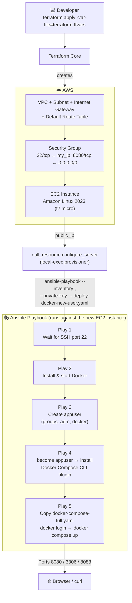
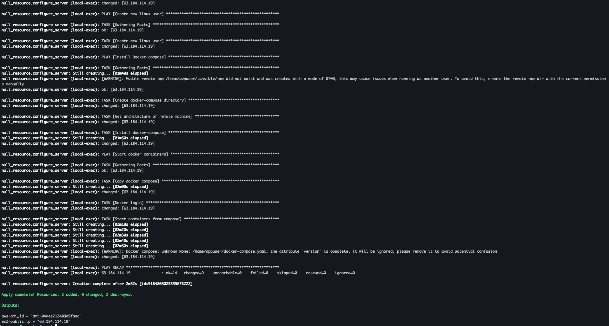
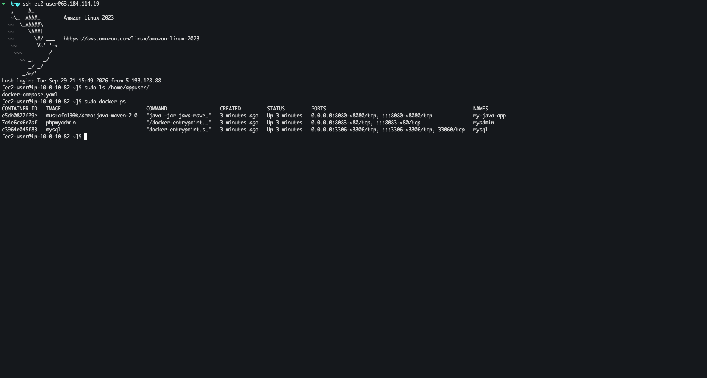

# 🚀 Ansible Integration in Terraform Provision EC2 and Configure Docker


**Terraform** is an infrastructure as code (IaC) tool that lets you build, change, and version infrastructure safely and efficiently. It works with resources from cloud providers as well as on-prem services, describing infrastructure using a high-level configuration language called **HCL (HashiCorp Configuration Language)**. Terraform generates an execution plan describing what it will do to reach the desired state, and then executes it to build the described infrastructure, keeping track of the real-world resources it manages in a **state file**.

**Ansible Automation** is an open-source, agentless IT automation engine that automates provisioning, configuration management, application deployment, and orchestration across large fleets of servers. It describes the *desired state* of a system using simple, human-readable YAML files called **playbooks**, and pushes those changes to managed nodes over standard **SSH** — without requiring any agent, daemon, or extra software installed on the target machines. Because every module is designed to be **idempotent**, running the same automation twice produces the same end state without unintended side effects, which makes Ansible a safe, repeatable and auditable way to manage infrastructure at scale.

## 📖 Overview

This project demonstrates how to combine **Terraform** and **Ansible** into a single, hands-off provisioning pipeline. Terraform is responsible for the underlying **AWS** infrastructure — a VPC, subnet, internet gateway, route table, security group and an **EC2** instance — while **Ansible** is responsible for everything that happens *inside* that server once it exists: installing **Docker** and **Docker Compose**, creating a dedicated non-root Linux user, shipping a multi-container application stack, authenticating against a private Docker registry, and starting the containers.

The key part of this project is the **integration** between the two tools: instead of manually copying the EC2 instance's IP address into an Ansible inventory file after every `terraform apply`, Terraform's `null_resource` and `local-exec` **provisioner** invokes `ansible-playbook` automatically the moment the instance's public IP becomes available — turning "provision infrastructure" and "configure the application" into a single command.

### ✨ Ansible Automation key features

- 🔓 **Agentless architecture** — connects to managed nodes purely over SSH (or WinRM for Windows), so there is nothing to install or maintain on the target servers
- 📝 **Human-readable YAML playbooks** — automation logic is expressed as simple, declarative YAML instead of custom scripting
- 🔁 **Idempotency** — tasks can be run repeatedly and will only change the system when it drifts from the desired state
- 🧩 **Modular building blocks** — reusable **Modules**, **Roles** and **Collections** let automation be composed, shared and version-controlled
- ⚡ **Ad-hoc command execution** — one-off tasks (e.g. `ping`, `shell`, `yum`) can be run instantly across a fleet without writing a full playbook
- 🗂️ **Flexible inventory management** — hosts can be grouped by region, role or environment, and inventories can even be generated **dynamically**, as demonstrated by this project's Terraform-driven inventory
- 🔌 **Extensibility** — custom modules and plugins (e.g. `community.docker.docker_compose_v2`) can extend Ansible's behaviour to fit any infrastructure need
- 🏪 **Ansible Galaxy** — a public registry for discovering and sharing community-built roles and collections
- 🔒 **Secure secrets handling** — sensitive data (passwords, keys, tokens) can be externalized into `vars_files` and encrypted at rest using **Ansible Vault**
- 🎯 **Infrastructure-as-code integration** — provisioners like Terraform's `local-exec` let Ansible playbooks run automatically right after infrastructure is created, chaining IaC and configuration management into one seamless workflow, exactly as demonstrated in this project

## Demo Project

Ansible Integration in Terraform Provision EC2 and Configure Docker

## Technologies used

- Ansible
- Terraform
- AWS
- Docker
- Linux

## Project Description

- Create AWS EC2 Instance with Terraform
- Write Ansible Playbook that installs necessary technologies like Docker and Docker Compose, copies docker-compose file to the server and starts the Docker containers configured inside the docker-compose file
- Create Ansible Playbook for Terraform integration
- Adjust Terraform configuration to execute Ansible Playbook automatically, so once Terraform provisions a server, it executes an Ansible playbook that configures the server

## 📁 Repository structure

```text
ansible-integration-in-terraform-provision-ec2-and-configure-docker/
├── NOTES.md                        # Personal study notes covering the full Ansible learning path
├── README.md                       # This file 📄
├── .gitignore                      # Excludes tfstate, .terraform/, *.tfvars & project-vars from git
├── images/                         # Screenshots captured while running the demo
│   ├── terraform-apply-terminal.png
│   └── ec2-server-docker-running-terminal.png
├── terraform/                      # Infrastructure as Code - provisions the AWS EC2 instance
│   ├── providers.tf                  # AWS provider & required Terraform version
│   ├── main.tf                       # VPC, subnet, security group, EC2 instance & Ansible provisioner
│   ├── entry-script.sh                # Reference: manual bash equivalent of the Docker install steps
│   ├── example.tfvars                 # Template committed to the repo - copy to terraform.tfvars
│   └── terraform.tfvars               # Local, git-ignored real values (region, CIDR, IP, key paths)
├── ansible/                         # Configuration Management - configures the EC2 instance
│   ├── ansible.cfg                    # Ansible configuration (default inventory, SSH behaviour)
│   ├── hosts                           # Static inventory file (used for manual/ad-hoc runs)
│   ├── deploy-docker-new-user.yaml     # Main playbook - installs Docker/Compose & deploys the stack
│   ├── project-vars                     # Local, git-ignored vars file (docker_password)
│   └── example-project-vars             # Template committed to the repo - copy to `project-vars`
└── bootcamp-java-mysql-project/     # The application stack that gets deployed to the EC2 instance
    ├── docker-compose-full.yaml       # 3-tier stack: Java app + MySQL + phpMyAdmin (used by Ansible)
    ├── docker-compose.yaml            # Local dev compose file (MySQL + phpMyAdmin only)
    ├── Dockerfile                      # Builds the Java application image
    └── src/                             # Java application source code
```

## 🏗️ Architecture overview



- **Terraform** is the control node for infrastructure: it defines the VPC, subnet, internet gateway, route table, security group and the EC2 instance itself, using the AWS provider
- The **security group** only opens SSH (port 22) to the developer's own IP (`var.my_ip`) while opening the application port (8080) to the world — a sensible default for a demo, and easily tightened further for production
- Once the EC2 instance's public IP is known, Terraform's `null_resource` + `local-exec` **provisioner** hands off control to **Ansible**, passing the IP as a one-off, dynamically generated inventory entry (`--inventory <ip>,`)
- **Ansible** then runs five sequential plays against that single host: waiting for SSH to be ready, installing Docker, creating a dedicated non-root user, installing Docker Compose, and finally deploying the application stack
- The deployed stack — a Java app, MySQL and phpMyAdmin — is reachable on ports **8080**, **3306** and **8083** respectively

## 🧭 Implementation Guide

### 1. Prerequisites

Before running this automation, make sure you have the following in place:

- ✅ **Terraform installed** on your local/control machine, see [Terraform's install guide](https://developer.hashicorp.com/terraform/install)

  ```bash
  # macOS
  brew tap hashicorp/tap
  brew install hashicorp/tap/terraform
  ```

- ✅ **Ansible installed** on your local/control machine

  ```bash
  # macOS
  brew install ansible

  # or via pip (Ansible is written in Python)
  pip install ansible
  ```

- ✅ An **AWS account** with credentials configured locally (e.g. via `aws configure` or environment variables), since the Terraform AWS provider authenticates using the standard AWS credential chain, see [Terraform AWS Provider docs](https://registry.terraform.io/providers/hashicorp/aws/latest/docs)
- ✅ An **SSH key pair** generated locally, whose public key path is referenced in [terraform.tfvars](terraform/terraform.tfvars) and gets attached to the EC2 instance via `aws_key_pair`

  ```bash
  ssh-keygen -t ed25519 -f ~/.ssh/id_ed25519
  ```

- ✅ A **Docker Hub** (or other private registry) account, since the deployment playbook authenticates with `docker_login` before pulling the application image
- ✅ Local copies of the two git-ignored variable files, created from the templates committed to the repo:

  ```bash
  cd terraform
  cp example.tfvars terraform.tfvars
  # then edit terraform.tfvars with your own region, CIDR blocks, IP and key paths

  cd ../ansible
  cp example-project-vars project-vars
  # then edit project-vars with your own docker_password
  ```

### 2. Provision the AWS network & EC2 instance with Terraform

The core of the infrastructure lives in [terraform/main.tf](terraform/main.tf). It declares, in order:

- A **VPC** (`aws_vpc`) with DNS hostnames enabled
- A **subnet** (`aws_subnet`) inside that VPC, pinned to a specific availability zone
- An **internet gateway** (`aws_internet_gateway`) and a **default route table** (`aws_default_route_table`) routing `0.0.0.0/0` traffic through it, giving the subnet internet access
- A **default security group** (`aws_default_security_group`) allowing inbound SSH (22) only from the operator's own IP, inbound 8080 from anywhere, and unrestricted egress
- A **data source** (`data "aws_ami"`) that dynamically resolves the latest **Amazon Linux 2023** AMI, avoiding a hardcoded, region-specific AMI ID
- An **`aws_key_pair`** resource that uploads the local public key so Ansible/SSH can authenticate
- The **`aws_instance`** itself (`myapp-server`), attached to the subnet, security group and key pair

```hcl
provider "aws" {
  region = "eu-central-1"
}

resource "aws_instance" "myapp-server" {
  ami = data.aws_ami.latest-amazon-linux-image.id
  instance_type = var.instance_type

  subnet_id = aws_subnet.myapp-subnet-1.id
  vpc_security_group_ids = [aws_default_security_group.default-sg.id]
  availability_zone = var.avail_zone

  associate_public_ip_address = true
  key_name = aws_key_pair.ssh-key.key_name

  tags = {
    Name: "${var.env_prefix}-server"
  }
}
```

The provider version is pinned in [terraform/providers.tf](terraform/providers.tf) to keep the build reproducible:

```hcl
terraform {
  required_providers {
    aws = {
      source = "hashicorp/aws"
      version = "5.20.1"
    }
  }
}
```

Environment-specific values (region details, CIDR blocks, the operator's IP, key file paths) are kept out of version control and supplied through a `.tfvars` file, following [Terraform's recommended variable-definition pattern](https://developer.hashicorp.com/terraform/language/values/variables#variable-definitions-tfvars-files):

```ini
# Update these values to match your AWS setup and workstation IP
vpc_cidr_block     = "10.0.0.0/16"
subnet_cidr_block  = "10.0.10.0/24"
avail_zone         = "us-east-1a"
env_prefix         = "dev"
my_ip              = "YOUR_IP/32"
instance_type      = "t2.micro"
public_key_location = "PATH_TO_PUB_KEY"
private_key_location = "PATH_TO_PRIV_KEY"
```

> 💡 [terraform/entry-script.sh](terraform/entry-script.sh) documents the manual, bash equivalent of installing Docker on the instance (`yum install docker`, `systemctl start docker`, `usermod -aG docker`). It was the starting reference point before the exact same steps were re-implemented as idempotent Ansible tasks in the next section — it is no longer wired into Terraform as `user_data` since Ansible now owns that responsibility.

Initialize and apply the Terraform configuration:

```bash
cd terraform
terraform init
terraform plan -var-file=terraform.tfvars
terraform apply -var-file=terraform.tfvars
```

### 3. Write the Ansible Playbook that configures Docker

Before wiring anything into Terraform, the configuration logic was built and tested as a standalone playbook: [ansible/deploy-docker-new-user.yaml](ansible/deploy-docker-new-user.yaml), organized into **five plays**.

**Play 1 — Wait for SSH to be ready**

```yaml
- name: Wait for SSH connection
  hosts: all
  gather_facts: False
  tasks:
    - name: Ensure SSH port open
      wait_for:
        port: 22
        delay: 10
        timeout: 100
        search_regex: OpenSSH
        host: '{{ (ansible_ssh_host|default(ansible_host))|default(inventory_hostname) }}'
      vars:
        ansible_connection: local
        ansible_python_interpreter: /usr/bin/python3
```

Because the EC2 instance may still be booting when the playbook first tries to connect, `wait_for` polls the target's SSH port **locally** (`ansible_connection: local`) until OpenSSH responds, avoiding a race condition between "instance created" and "instance actually reachable".

**Play 2 — Install Docker**

```yaml
- name: Install Docker
  hosts: all
  become: yes
  tasks:
    - name: Install Docker
      yum:
        name: docker
        update_cache: yes
        state: present
    - name: Start docker daemon
      systemd:
        name: docker
        state: started
```

Amazon Linux uses the **`yum`** package manager (rather than `apt`), and the Docker daemon is started and enabled via the `systemd` module.

**Play 3 — Create a dedicated Linux user**

```yaml
- name: Create new linux user
  hosts: all
  become: yes
  tasks: 
    - name: Create new linux user
      user:
        name: appuser
        groups: adm,docker
```

Running the application stack under its own user (`appuser`) rather than `ec2-user`/`root` follows the **principle of least privilege**; adding it to the `docker` group lets it run Docker commands without needing `sudo` for every container operation.

**Play 4 — Install Docker Compose as a CLI plugin**

```yaml
- name: Install Docker-compose
  hosts: all
  become: yes
  become_user: appuser
  tasks:
    - name: Create docker-compose directory
      file:
        path: ~/.docker/cli-plugins
        state: directory
    - name: Get architecture of remote machine
      shell: uname -m
      register: remote_arch
    - name: Install docker-compose
      get_url:
        url: "https://github.com/docker/compose/releases/latest/download/docker-compose-linux-{{ remote_arch.stdout }}"
        dest: ~/.docker/cli-plugins/docker-compose
        mode: +x
```

Docker Compose is installed as the modern **[CLI plugin](https://docs.docker.com/compose/install/linux/)** (`docker compose`, not the legacy standalone `docker-compose` binary), dropped into `~/.docker/cli-plugins/`. The remote CPU architecture is detected at runtime with `uname -m` and interpolated into the GitHub release download URL, so the same task works whether the EC2 instance type is x86_64 or ARM-based.

**Play 5 — Deploy the application stack**

```yaml
- name: Start docker containers
  hosts: all
  become: yes
  become_user: appuser
  vars_files:
    - project-vars
  tasks:
    - name: Copy docker compose 
      copy:
        src: ../bootcamp-java-mysql-project/docker-compose-full.yaml
        dest: /home/appuser/docker-compose.yaml
    - name: Docker login
      docker_login:
        username: mustafa199b
        password: "{{docker_password}}"
    - name: Start containers from compose
      community.docker.docker_compose_v2:
        project_src: /home/appuser
```

- `vars_files: - project-vars` — the Docker Hub password is externalized into a **git-ignored** vars file instead of being hardcoded in the playbook, keeping credentials out of version control (for production use, this value would ideally be encrypted with **Ansible Vault** rather than kept as plaintext)
- `copy` ships the [bootcamp-java-mysql-project/docker-compose-full.yaml](bootcamp-java-mysql-project/docker-compose-full.yaml) stack definition straight from the control node to the new user's home directory
- `docker_login` authenticates against Docker Hub so the private application image can be pulled
- `community.docker.docker_compose_v2` is the Ansible Collection module that wraps the modern `docker compose` CLI plugin, bringing the whole stack up declaratively

The application stack itself, [docker-compose-full.yaml](bootcamp-java-mysql-project/docker-compose-full.yaml), defines three services:

```yaml
version: '3'
services:
  java-app:
    image: mustafa199b/demo:java-maven-2.0
    environment:
      - DB_USER=user
      - DB_PWD=pass
      - DB_SERVER=mysql
      - DB_NAME=my-app-db
    ports:
    - 8080:8080
    container_name: my-java-app
  mysql:
    image: mysql
    ports:
      - 3306:3306
    environment:
      - MYSQL_ROOT_PASSWORD=my-secret-pw
      - MYSQL_DATABASE=my-app-db
      - MYSQL_USER=user
      - MYSQL_PASSWORD=pass
    volumes:
    - mysql-data:/var/lib/mysql
    container_name: mysql
  phpmyadmin:
    image: phpmyadmin
    environment:
      - PMA_HOST=mysql
    ports:
      - 8083:80
    container_name: myadmin
volumes:
  mysql-data:
    driver: local
```

- **`java-app`** — a pre-built Java/Maven application image, connecting to MySQL using environment variables
- **`mysql`** — the backing relational database, persisting its data to a named Docker **volume** (`mysql-data`) so data survives container restarts
- **`phpmyadmin`** — a web UI for inspecting/administering the MySQL database, pointed at the `mysql` service by name (Docker Compose's built-in service discovery)

### 4. Integrate Ansible into Terraform with a provisioner

With the playbook proven to work standalone, the final step was wiring it into Terraform so it runs **automatically** right after the EC2 instance is created — no manual inventory editing, no manually re-running `ansible-playbook`:

```hcl
resource "null_resource" "configure_server" {
  triggers = {
    trigger = aws_instance.myapp-server.public_ip
  }

  provisioner "local-exec" {
    working_dir = "../ansible"
    command = "ansible-playbook --inventory ${aws_instance.myapp-server.public_ip}, --private-key ${var.private_key_location} --user ec2-user deploy-docker-new-user.yaml"
  }
}
```

- **`null_resource`** is a Terraform resource with no real infrastructure behind it — it exists purely to attach the provisioner logic to Terraform's dependency graph
- **`triggers`** ties this resource to the EC2 instance's public IP: if the IP ever changes (e.g. the instance is replaced), Terraform knows to re-run the provisioner
- **`local-exec`** runs the given command **on the machine running Terraform** (the control node), not on the remote instance — which is exactly where `ansible-playbook` needs to run from
- The `--inventory ${aws_instance.myapp-server.public_ip},` flag builds a **one-off, dynamic inventory** on the fly (the trailing comma tells Ansible to treat the value as a host list rather than a file path), removing any need to hand-maintain a static `hosts` file for this automated flow
- `--private-key` and `--user ec2-user` supply the SSH credentials Ansible needs to connect to the freshly created instance

> 📌 The static [ansible/hosts](ansible/hosts) inventory file is still kept in the repo for **manual/ad-hoc** runs and troubleshooting directly against a known host, independent of the Terraform-driven flow.

### 5. Apply & watch the full pipeline run end-to-end

With everything wired together, a single command provisions the AWS infrastructure **and** configures the application on top of it:

```bash
cd terraform
terraform apply -var-file=terraform.tfvars
```

Terraform first creates the VPC/networking/EC2 resources, then immediately triggers the `null_resource.configure_server` provisioner, which shells out to `ansible-playbook` and streams the playbook's own output straight into the Terraform apply log:



The `PLAY RECAP` (`ok=14 changed=9 ... failed=0`) confirms every Ansible task succeeded, followed by Terraform's own `Apply complete!` summary and the `ec2-public_ip` / `aws-ami_id` outputs.

### 6. Verify the deployment

SSH-ing into the newly provisioned EC2 instance confirms the compose file was copied correctly and all three containers are up and healthy:

```bash
ssh ec2-user@<ec2-public-ip>
sudo ls /home/appuser/
sudo docker ps
```



`docker ps` shows `my-java-app`, `myadmin` and `mysql` all `Up`, bound to ports `8080`, `8083` and `3306` respectively — confirming the application is reachable from a browser at `http://<ec2-public-ip>:8080` (and phpMyAdmin at `:8083`).

## ✅ Final result

By the end of this demo:

- 🖥️ A complete AWS network (VPC, subnet, internet gateway, route table, security group) and an EC2 instance were provisioned entirely through **Terraform**, with the AMI resolved dynamically rather than hardcoded
- 🔗 Terraform's `null_resource` + `local-exec` **provisioner** was configured to automatically invoke `ansible-playbook` the moment the instance's public IP became available, passing it in as a one-off dynamic inventory
- ⚙️ **Ansible** installed Docker and the modern Docker Compose CLI plugin on the instance, waiting safely for SSH to come up first
- 👤 A dedicated, least-privilege Linux user (`appuser`) was created and added to the `docker` group to own and run the application containers
- 🔐 Docker Hub credentials were externalized into a git-ignored `project-vars` file rather than hardcoded, and used to authenticate via the `docker_login` module
- 📦 A three-service application stack (Java app + MySQL + phpMyAdmin) was shipped and started with `community.docker.docker_compose_v2`, and verified running with `docker ps`
- 🔁 The entire pipeline — from `terraform apply` to a fully running, multi-container application — is **repeatable and idempotent**, turning infrastructure provisioning and application configuration into a single, unified command

This project demonstrates a practical, production-style pattern for combining **Infrastructure as Code** and **Configuration Management**: Terraform owns the infrastructure lifecycle, Ansible owns the software configuration, and a Terraform provisioner bridges the two into one seamless, automated deployment pipeline.

## 📚 References

- [Terraform Documentation](https://developer.hashicorp.com/terraform/docs)
- [Terraform AWS Provider](https://registry.terraform.io/providers/hashicorp/aws/latest/docs)
- [Terraform `null_resource`](https://registry.terraform.io/providers/hashicorp/null/latest/docs/resources/resource)
- [Terraform `local-exec` Provisioner](https://developer.hashicorp.com/terraform/language/resources/provisioners/local-exec)
- [Terraform Variable Definitions (`.tfvars` files)](https://developer.hashicorp.com/terraform/language/values/variables#variable-definitions-tfvars-files)
- [Ansible Documentation](https://docs.ansible.com/)
- [Ansible Modules Index](https://docs.ansible.com/projects/ansible/latest/collections/index_module.html)
- [Ansible `wait_for` module](https://docs.ansible.com/ansible/latest/collections/ansible/builtin/wait_for_module.html)
- [Ansible `yum` module](https://docs.ansible.com/ansible/latest/collections/ansible/builtin/yum_module.html)
- [Ansible `user` module](https://docs.ansible.com/ansible/latest/collections/ansible/builtin/user_module.html)
- [Ansible `docker_login` module](https://docs.ansible.com/ansible/latest/collections/community/docker/docker_login_module.html)
- [Ansible `community.docker.docker_compose_v2` module](https://docs.ansible.com/ansible/latest/collections/community/docker/docker_compose_v2_module.html)
- [Ansible Vault](https://docs.ansible.com/ansible/latest/vault_guide/index.html)
- [Docker Compose CLI Plugin Installation](https://docs.docker.com/compose/install/linux/)
- [AWS EC2 Documentation](https://docs.aws.amazon.com/ec2/)
- [Amazon Linux 2023](https://docs.aws.amazon.com/linux/al2023/ug/what-is-amazon-linux.html)
