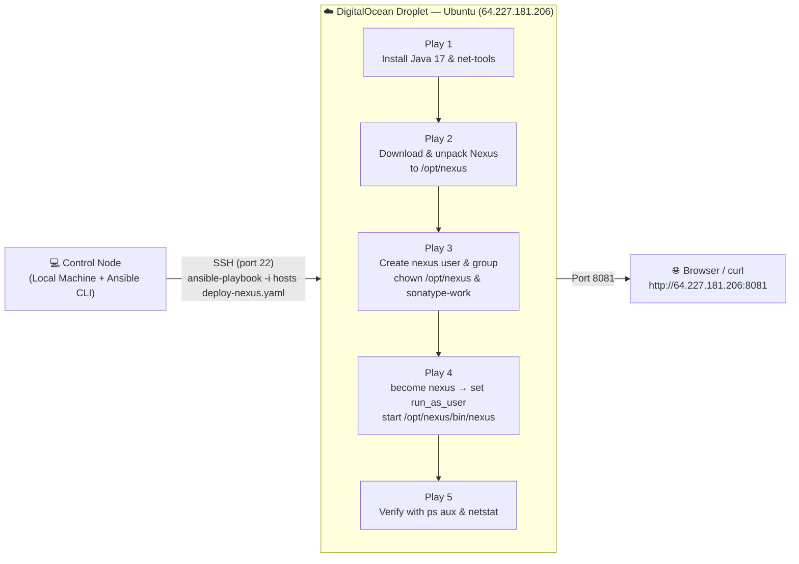

# 🚀 Ansible Automate Nexus Deployment


**Sonatype Nexus Repository** is a repository manager that organizes, stores, and distributes build artifacts (such as Maven, npm, Docker, PyPI and other package formats) from a single, central location, allowing development teams to control the storage, sharing and management of software components across the entire development lifecycle. It is commonly deployed as the internal artifact store that CI/CD pipelines publish to and resolve dependencies from, acting as a caching proxy for public repositories and a private registry for internally built packages.

**Ansible Automation** is an open-source, agentless IT automation engine that automates provisioning, configuration management, application deployment, and orchestration across large fleets of servers. It describes the *desired state* of a system using simple, human-readable YAML files called **playbooks**, and pushes those changes to managed nodes over standard **SSH** — without requiring any agent, daemon, or extra software installed on the target machines. Because every module is designed to be **idempotent**, running the same automation twice produces the same end state without unintended side effects, which makes Ansible a safe, repeatable and auditable way to manage infrastructure at scale.

## 📖 Overview

This project demonstrates how to use **Ansible** to fully automate the installation and deployment of **Sonatype Nexus Repository Manager** onto a freshly provisioned **DigitalOcean** droplet running **Linux (Ubuntu)**. Instead of manually SSH-ing into the server and typing out each installation step by hand, the entire workflow — installing **Java** and system dependencies, downloading and unpacking the Nexus installer, creating a dedicated non-root Linux user to own and run the service, configuring Nexus to start as that user, and verifying that the process is actually up and listening — is codified into a single, reusable and idempotent Ansible playbook ([deploy-nexus.yaml](deploy-nexus.yaml)).

### ✨ Ansible Automation key features

- 🔓 **Agentless architecture** — connects to managed nodes purely over SSH (or WinRM for Windows), so there is nothing to install or maintain on the target servers
- 📝 **Human-readable YAML playbooks** — automation logic is expressed as simple, declarative YAML instead of custom scripting
- 🔁 **Idempotency** — tasks can be run repeatedly and will only change the system when it drifts from the desired state
- 🧩 **Modular building blocks** — reusable **Modules**, **Roles** and **Collections** let automation be composed, shared and version-controlled
- ⚡ **Ad-hoc command execution** — one-off tasks (e.g. `ping`, `shell`, `apt`) can be run instantly across a fleet without writing a full playbook
- 🗂️ **Flexible inventory management** — hosts can be grouped by region, role or environment, with variables applied per host or per group (`group_vars`)
- 🔌 **Extensibility** — custom modules and plugins can extend Ansible's behaviour to fit any infrastructure need
- 🏪 **Ansible Galaxy** — a public registry for discovering and sharing community-built roles and collections
- 🔒 **Secure secrets handling** — sensitive data (passwords, keys, tokens) can be encrypted at rest using **Ansible Vault**
- 🎯 **Conditionals & facts gathering** — tasks such as downloading and renaming the Nexus installer only run `when` a pre-condition is met (e.g. the install folder doesn't already exist), making re-runs safe and non-destructive, exactly as demonstrated in this project

## Demo Project

Ansible Automate Nexus Deployment

## Technologies used

- Ansible
- Nexus
- Java
- DigitalOcean
- Linux

## Project Description

- Create Server on DigitalOcean
- Write Ansible Playbook that creates Linux user for Nexus, configure server, installs and deploys Nexus and verifies that it is running successfully

## 📁 Repository structure

```text
ansible-automate-nexus-deployment/
├── ansible.cfg                # Ansible configuration (default inventory, SSH behaviour)
├── hosts                      # Inventory file - lists the target DigitalOcean droplet as [nexus_server]
├── deploy-nexus.yaml          # Main playbook - installs Java, downloads & starts Nexus, verifies it's running
├── project-vars                # Local, git-ignored vars file consumed by the playbook (nexus_download_url, etc.)
├── example-project-vars        # Template committed to the repo - copy to `project-vars` before running
├── nexus.sh                    # Manual shell reference for the steps the playbook automates
├── NOTES.md                    # Personal study notes covering the full Ansible learning path
├── README.md                   # This file 📄
└── images/                     # Screenshots captured while running the demo
    ├── nexus-playbook-terminal.png
    └── nexus-playbook-verify-terminal.png
```

## 🏗️ Architecture overview



- The **control node** is the local machine where Ansible is installed and the playbook is executed from
- The **managed node** is the DigitalOcean droplet, targeted through the `nexus_server` group defined in the [hosts](hosts) inventory file
- Ansible connects over **SSH using a key pair**, requiring **no agent** installed on the droplet
- The playbook is organized into **five sequential plays**, each targeting the `nexus_server` group but responsible for a distinct part of the desired end-state: dependency installation → download/unpack → user provisioning → service startup → verification
- Once deployed, Nexus Repository listens on its default port **8081** and can be reached directly from a browser

## 🧭 Implementation Guide

### 1. Prerequisites

Before running this automation, make sure you have the following in place:

- ✅ **Ansible installed** on your local/control machine

  ```bash
  # macOS
  brew install ansible

  # or via pip (Ansible is written in Python)
  pip install ansible
  ```

- ✅ A **DigitalOcean account** with a droplet created (Ubuntu image), see [DigitalOcean's Droplet quickstart](https://docs.digitalocean.com/products/droplets/getting-started/quickstart/)
- ✅ An **SSH key pair** generated locally and added to the droplet at creation time, so Ansible can authenticate without a password

  ```bash
  ssh-keygen -t ed25519 -f ~/.ssh/id_ed25519
  ```

- ✅ Enough droplet memory/CPU for Nexus — Sonatype's official guidance recommends at least **2 vCPUs and 4-8 GB of RAM** for a Nexus Repository instance, see [Sonatype's System Requirements](https://help.sonatype.com/en/system-requirements.html)
- ✅ A copy of the vars template in place before running the playbook, since `project-vars` is intentionally excluded from version control via [.gitignore](.gitignore):

  ```bash
  cp example-project-vars project-vars
  ```

### 2. Provision the DigitalOcean Droplet

- A single Ubuntu droplet was created from the DigitalOcean control panel, with the local SSH public key (`~/.ssh/id_ed25519.pub`) attached during creation so that key-based authentication is available immediately
- Once created, DigitalOcean assigns a public IPv4 address to the droplet (`64.227.181.206` in this demo) which becomes the target host for every Ansible command below

### 3. Configure the Ansible Inventory & SSH connectivity

The [hosts](hosts) file tells Ansible which server(s) to manage, groups it under `nexus_server` (matching the `hosts:` value used in every play of the playbook) and how to authenticate against it:

```ini
[nexus_server]
64.227.181.206 ansible_ssh_private_key_file=~/.ssh/id_ed25519 ansible_user=root
```

The [ansible.cfg](ansible.cfg) file sets sane defaults for this project, so the inventory file doesn't need to be passed with `-i` on every command, and SSH host-key prompts are skipped for this ephemeral, single-use droplet:

```ini
[defaults]
host_key_checking = False
inventory = hosts
```

> ⚠️ Disabling `host_key_checking` is convenient for short-lived demo/lab infrastructure, but for production hosts it's best practice to keep host key verification enabled (or pre-seed `~/.ssh/known_hosts` with `ssh-keyscan`) to guard against man-in-the-middle attacks.

### 4. Verify connectivity with an Ansible ad-hoc command

Before writing or running any playbook, connectivity and authentication were validated with the built-in `ping` module:

```bash
ansible all -i hosts -m ping
```

A successful response confirms Ansible can reach the droplet over SSH and that the Python interpreter required by Ansible modules is available on the remote host.

### 5. Understand the manual installation process first

Before automating anything, the manual installation steps were captured in [nexus.sh](nexus.sh) — this is the exact sequence of commands a human operator would type by hand on the server, and it's the baseline that the Ansible playbook needed to reproduce automatically:

```bash
apt-get update
apt install openjdk-8-jre-headless
apt install net-tools

cd /opt
wget https://download.sonatype.com/nexus/3/latest-linux-x86_64.tar.gz
tar -zxvf latest-linux-x86_64.tar.gz

adduser nexus
chown -R nexus:nexus nexus-3.65.0-02
chown -R nexus:nexus sonatype-work

vim nexus-3.65.0-02/bin/nexus.rc
run_as_user="nexus"

su - nexus
/opt/nexus-3.65.0-02/bin/nexus start

ps aux | grep nexus
netstat -lnpt
```

Turning this manual checklist into a playbook removes hardcoded version numbers, makes the process idempotent, and lets the exact same automation be re-run against any new droplet in minutes.

### 6. Externalize configuration with an Ansible vars file

Rather than hardcoding the Nexus download URL inside the playbook, the value is externalized into a `vars_files` entry. Since `project-vars` is git-ignored (it can hold environment-specific/sensitive values), [example-project-vars](example-project-vars) is committed as a template to be copied locally:

```yaml
version: 1.0.0
location: /path/to/project/files
linux_name: appuser
user_home_dir: /home/{{linux_name}}
nexus_download_url: https://download.sonatype.com/nexus/3/latest-linux-x86_64.tar.gz
```

### 7. Write the Ansible Playbook

The core of this project is [deploy-nexus.yaml](deploy-nexus.yaml), organized into **five plays** that run in order against the `nexus_server` group:

**Play 1 — Install Java & net-tools**

```yaml
- name: Install java and net-tools
  hosts: nexus_server
  tasks:
    - name: Update apt repo and cache
      apt: update_cache=yes force_apt_get=yes cache_valid_time=3600
    - name: Install Java 17
      apt: name=openjdk-17-jre-headless
    - name: Install net-tools
      apt: name=net-tools
```

Nexus is a Java application, so the **Java Runtime Environment (JRE)** is a hard prerequisite; `net-tools` provides `netstat`, used later to confirm the service is listening on its port.

**Play 2 — Download and unpack the Nexus installer**

```yaml
- name: Download and unpack Nexus installer
  hosts: nexus_server
  vars_files:
    - project-vars
  tasks:
    - name: Check nexus folder stats
      stat:
        path: /opt/nexus
      register: stat_result
    - name: Download Nexus
      get_url:
        url: "{{nexus_download_url}}"
        dest: /opt/
      register: download_result
    - name: Untar Nexus installer
      unarchive:
        src: "{{download_result.dest}}"
        dest: /opt/
        remote_src: yes
      when: not stat_result.stat.exists
    - name: Find nexus folder
      find: 
        paths: /opt
        pattern: "nexus-*"
        file_type: directory
      register: find_result
    - name: Rename nexus folder
      shell: mv {{find_result.files[0].path}} /opt/nexus
      when: not stat_result.stat.exists
```

- `stat` checks whether `/opt/nexus` already exists **before** doing any work
- `get_url` + `unarchive` (with `remote_src: yes`) download the archive straight on the remote host and extract it in place, avoiding an unnecessary round-trip through the control node
- `find` locates the freshly extracted, version-numbered folder (e.g. `nexus-3.65.0-02`) so it can be renamed to a stable, version-agnostic path
- Both the extraction and the rename are guarded by `when: not stat_result.stat.exists`, so **re-running the playbook is a no-op** once Nexus is already installed — a direct example of Ansible idempotency

**Play 3 — Create a dedicated Linux user to own Nexus**

```yaml
- name: Create nexus user to own nexus folder
  hosts: nexus_server
  tasks:
    - name: Ensure group nexus exists
      group:
        name: nexus
        state: present
    - name: Create nexus user 
      user:
        name: nexus
        group: nexus
    - name: Make nexus user owner of nexus folder
      file:
        path: /opt/nexus
        state: directory
        owner: nexus
        group: nexus
        recurse: yes
    - name: Make nexus user owner of sonatype-work folder
      file:
        path: /opt/sonatype-work
        state: directory
        owner: nexus
        group: nexus
        recurse: yes
```

Running Nexus under its own non-root user (`nexus`) rather than `root` follows the **principle of least privilege**, reducing the blast radius should the service ever be compromised. Both the binary directory (`/opt/nexus`) and the data/runtime directory (`/opt/sonatype-work`) are `chown`-ed recursively to that user.

**Play 4 — Start Nexus as the `nexus` user**

```yaml
- name: Start nexus with nexus user
  hosts: nexus_server
  become: True
  become_user: nexus
  tasks:
    # From Version 3.80.0 onwards: Sonatype officially stopped providing the nexus.rc file in the distribution package
    - name: Find nexus config file nexus.rc
      find: 
        paths: /opt/nexus/bin/
        pattern: "nexus.rc"
        file_type: file
      register: find_result
    - name: Create nexus config if missing
      file:
        path: /opt/nexus/bin/nexus.rc
        state: touch
      when: find_result.matched == 0
    - name: Set run_as_user nexus
      lineinfile: 
        path: /opt/nexus/bin/nexus.rc
        regexp: '^#run_as_user=""'
        line: run_as_user="nexus"
    - name: Start nexus
      command: /opt/nexus/bin/nexus start
```

- `become: True` + `become_user: nexus` — every task in this play is privilege-escalated then executed **as `nexus`**, instead of the SSH login user (`root`)
- The `find` + conditional `file: state=touch` pair defensively re-creates `nexus.rc` if it's missing, since newer Nexus releases (3.80.0+) no longer ship this file by default
- `lineinfile` idempotently sets `run_as_user="nexus"` inside `nexus.rc` so the Nexus startup script always runs as the correct, unprivileged user
- `command` starts the Nexus service using its own bundled start script

**Play 5 — Verify Nexus is running**

```yaml
- name: Verify nexus running
  hosts: nexus_server
  tasks:
    - name: Check with ps
      shell: ps aux | grep nexus
      register: app_status
    - debug: msg={{app_status.stdout_lines}}
    - name: Wait one minute
      pause:
        minutes: 1 
    - name: Check with netstat
      shell: netstat -plnt
      register: app_status
    - debug: msg={{app_status.stdout_lines}}
```

- `shell` + `register` + `debug` — captures the output of `ps aux | grep nexus` into a variable and prints it to the console, confirming the Java process for Nexus is alive
- `pause: minutes: 1` — Nexus takes roughly a minute to fully bootstrap and bind its listening port, so the playbook waits before checking again
- A second `shell` + `netstat -plnt` check confirms the process is actually **listening** on its port, not just running as an OS process

### 8. Run the Playbook

With the inventory, configuration, vars file and playbook in place, the full deployment is triggered with a single command:

```bash
ansible-playbook -i hosts deploy-nexus.yaml
```

Ansible executes each play in order — gathering facts, installing Java/net-tools, downloading and unpacking Nexus, creating the `nexus` user, starting the service and verifying it — reporting `ok` / `changed` / `skipping` per task along the way:


### 9. Verify the deployment

The final play in the playbook itself performs the verification, printing the running Java process (the Nexus JAR) via `ps aux | grep nexus`, pausing for Nexus to finish starting up, and then confirming the port is listening via `netstat -plnt`:


The `PLAY RECAP` at the end (`ok=23 changed=3 skipped=3 failed=0`) confirms every play succeeded, with the `skipped` tasks being the download/rename steps correctly bypassed because Nexus was already installed from a previous run — demonstrating idempotency in action. With the process confirmed running, Nexus Repository Manager is reachable from a browser at `http://64.227.181.206:8081`.

## ✅ Final result

By the end of this demo:

- 🖥️ A DigitalOcean Ubuntu droplet was provisioned and made reachable via SSH key authentication
- ⚙️ Ansible was used to remotely install **Java 17** and `net-tools` with a single idempotent play
- 👤 A dedicated, least-privilege Linux user and group (`nexus`) were created to own and run the service
- 📦 The Nexus Repository installer was downloaded, unpacked and renamed to a stable path (`/opt/nexus`) using conditional, idempotent tasks
- 🚀 Nexus was configured to run as the `nexus` user and started via its bundled startup script
- 🔍 The deployment was verified end-to-end with `ps aux` and `netstat`, confirming both the running process and the listening port
- 🔁 The entire process is **repeatable and idempotent** — the same playbook can be re-run against this or any new droplet to reproduce the exact same environment in minutes, safely skipping steps that are already satisfied, with zero manual SSH steps

This project demonstrates a practical, end-to-end **Configuration Management** and **Application Deployment** workflow using Ansible — from provisioning through to a verified, running Nexus Repository Manager instance — the same pattern used to manage real production artifact repositories at scale.

## 📚 References

- [Ansible Documentation](https://docs.ansible.com/)
- [Ansible Getting Started Guide](https://docs.ansible.com/ansible/latest/getting_started/index.html)
- [Ansible Modules Index](https://docs.ansible.com/projects/ansible/latest/collections/index_module.html)
- [Ansible Collections](https://docs.ansible.com/ansible/latest/collections/index.html)
- [Ansible Galaxy](https://galaxy.ansible.com/)
- [Ansible `get_url` module](https://docs.ansible.com/ansible/latest/collections/ansible/builtin/get_url_module.html)
- [Ansible `unarchive` module](https://docs.ansible.com/ansible/latest/collections/ansible/builtin/unarchive_module.html)
- [Ansible `find` module](https://docs.ansible.com/ansible/latest/collections/ansible/builtin/find_module.html)
- [Ansible `lineinfile` module](https://docs.ansible.com/ansible/latest/collections/ansible/builtin/lineinfile_module.html)
- [Ansible `user` module](https://docs.ansible.com/ansible/latest/collections/ansible/builtin/user_module.html)
- [Ansible `become` (Privilege Escalation)](https://docs.ansible.com/ansible/latest/playbook_guide/playbooks_privilege_escalation.html)
- [Ansible Conditionals (`when`)](https://docs.ansible.com/ansible/latest/playbook_guide/playbooks_conditionals.html)
- [Ansible Variables & `vars_files`](https://docs.ansible.com/ansible/latest/playbook_guide/playbooks_variables.html)
- [DigitalOcean Droplets Documentation](https://docs.digitalocean.com/products/droplets/)
- [Sonatype Nexus Repository Documentation](https://help.sonatype.com/en/sonatype-nexus-repository.html)
- [Sonatype Nexus Repository System Requirements](https://help.sonatype.com/en/system-requirements.html)
- [OpenJDK Documentation](https://openjdk.org/)
